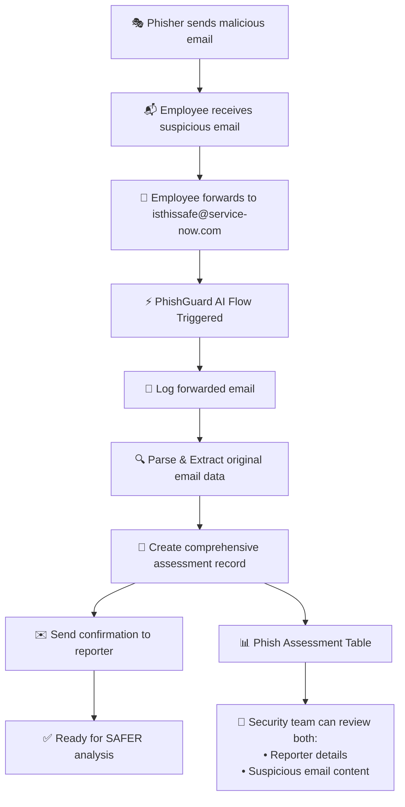

# PhishGuard AI - SAFER Framework Implementation

## Application Overview

**PhishGuard AI** is an email security and phishing detection application built on the ServiceNow platform. This application implements the **SAFER phishing analysis framework** to provide comprehensive email threat assessment capabilities.

### Application Details
- **Scope**: `x_snc_phishguard`
- **Version**: 0.0.1
- **SDK Version**: 4.4.1 (Fluent DSL)
- **Created**: December 2024
- **Last Updated**: January 2025

## SAFER Framework

The SAFER framework provides a systematic approach to phishing email analysis:

| Letter | Stands For | What It Checks |
|--------|------------|----------------|
| **S** | Sender Address | Display name vs. domain mismatch, typosquatting, spoofing |
| **A** | Attachments / Links | Suspicious file types, hidden URLs, shortened links |
| **F** | Feelings | Urgency, fear, confusion, curiosity triggers in content |
| **E** | External Email Tag | Presence and context of the [External Email] tag |
| **R** | Report | Overall SAFER score, record creation, security team alert |

## Implementation Progress

### Phase 1: Core Infrastructure ✅
- [x] Application created with scope `x_snc_phishguard`
- [x] Email processing flow established
- [x] NowAssist integration configured
- [x] Base ServiceNow SDK setup completed

### Phase 2: SAFER Framework Implementation ✅
- [x] **Phish Assessment Table** - Custom table to store SAFER analysis results ✅
  - Table: `x_snc_phishguard_assessment`
  - Label: "Phish Assessment"  
  - 22 fields covering Email Metadata, SAFER Scores, Overall Result, and Disposition
  - Created: `src/fluent/tables/phish-assessment.now.ts`
- [x] **List View Configuration** - Custom list showing key assessment data ✅
  - Fields: email_received_date, sender_email_address, safer_overall_score, disposition, security_team_notified, reported_by
  - Created: `src/fluent/lists/phish-assessment-list.now.ts`
- [x] **Exports Configuration** - Proper module exports in index.now.ts ✅

### Phase 3: Flow Integration ✅ **COMPLETED**
- [x] **Flow Analysis Complete** - Analyzed existing email processing flow structure ✅
- [x] **Table Structure Finalized** - Clean email field structure without redundant prefixes ✅
- [x] **Email References Added** - Both `email_record` and `forwarded_email_record` fields ✅
- [x] **List View Configuration** - Created list columns for proper display ✅
- [x] **Comprehensive Flow Documentation** - Complete step-by-step Flow Designer instructions ✅

### Phase 4: Flow Implementation (Manual) 🔄 **IN PROGRESS** 
- [ ] **Update Flow Designer** - User must manually implement the documented flow changes 📋
- [ ] **Test Email Parsing** - Verify forwarded email content extraction works 📋
- [ ] **Validate Record Creation** - Confirm assessment records are created with proper data 📋
- [ ] **List View Manual Config** - May require manual list layout configuration 📋

### Phase 5: SAFER Analysis Logic (Next) 📋 **PLANNED**
- [ ] **Automated Sender Analysis** - Business rules for display name vs domain checks
- [ ] **Attachment/Link Scanning** - URL and file analysis automation  
- [ ] **Content Analysis** - Urgency/fear trigger detection in email content
- [ ] **External Tag Verification** - Email tag presence and context analysis
- [ ] **Overall Risk Scoring** - Automated HIGH/MEDIUM/LOW assessment calculation

### Phase 4: SAFER Analysis Logic (Next) 📋
- [ ] Automated SAFER Scoring Engine  
- [ ] Security Team Notifications
- [ ] Reporting Dashboard

## Current Implementation Status

## ✅ **IMPLEMENTATION STATUS SUMMARY**

### 🎯 **COMPLETED (Ready for Use)**
- ✅ **Core Application Structure** - PhishGuard AI app with proper scope and configuration
- ✅ **Database Schema** - Complete 26-field Phish Assessment table with clean field names
- ✅ **Email Architecture** - Proper separation of forwarded vs original email data
- ✅ **List View Definition** - Configured to show: Email Date, Sender, Subject, Email Record
- ✅ **Flow Documentation** - Comprehensive step-by-step Flow Designer instructions
- ✅ **Email Parsing Logic** - JavaScript code for extracting original email from forwarded content

### 🔄 **IN PROGRESS (Manual Steps Required)**
- 🔄 **Flow Designer Update** - User must implement the documented flow changes
- 🔄 **List View Display** - May require manual list layout configuration in ServiceNow UI
- 🔄 **Email Flow Testing** - Need to test with actual forwarded emails to `isthissafe@service-now.com`

### 📋 **PLANNED (Future Development)**
- 📋 **SAFER Analysis Automation** - Business rules for automatic risk scoring
- 📋 **Security Team Notifications** - Automated alerts for high-risk assessments  
- 📋 **Reporting Dashboard** - Analytics and trend analysis for phishing attempts
- 📋 **Machine Learning Integration** - AI-powered content analysis enhancement

### 📋 Implementation Notes
- **Form Sections**: Fluent API currently doesn't support form section configuration
  - Sections would need to be configured post-deployment in ServiceNow UI
  - Recommended grouping: Email Metadata, SAFER Scores, Overall Result, Disposition
- **Table Access**: Configured as package_private for security isolation
- **Display Field**: Set to email_subject for easy record identification

## **📊 CURRENT TABLE STRUCTURE** - Phish Assessment ✅

### **🔄 Forwarded Email Metadata (4 fields)** - **IMPLEMENTED**
1. `forwarded_email_record` (Reference → sys_email) - The email sent to isthissafe@service-now.com ✅
2. `forwarded_email_date` (Date/Time) - When the forwarded email was received ✅
3. `reported_by` (Reference → sys_user) - ServiceNow employee who reported it ✅
4. `reporter_email_address` (String, 255) - Email address of the reporting employee ✅

### **📧 Original Email Metadata (6 fields)** - **IMPLEMENTED**  
5. `email_subject` (String, 500) - **Subject of the original email** ✅
6. `sender_display_name` (String, 255) - Display name from the email ✅
7. `sender_email` (String, 255) - **Email address of the sender** ✅
8. `sender_domain` (String, 255) - Domain of the sender ✅
9. `email_received_date` (Date/Time) - When employee originally received the email ✅
10. `email_body` (String, 4000) - Content of the original email ✅
11. `email_record` (Reference → sys_email) - **Link to the original email record** ✅

### **🔍 SAFER Analysis Fields (8 fields)** - **IMPLEMENTED**
12. `safer_s_risk` (Choice: HIGH/MEDIUM/LOW) - **Sender analysis result** ✅
13. `safer_s_notes` (String, 1000) - Sender analysis explanation ✅
14. `safer_a_risk` (Choice: HIGH/MEDIUM/LOW) - **Attachments/Links analysis** ✅
15. `safer_a_notes` (String, 1000) - Attachments/Links explanation ✅
16. `safer_f_risk` (Choice: HIGH/MEDIUM/LOW) - **Feelings/Urgency analysis** ✅
17. `safer_f_notes` (String, 1000) - Feelings/Urgency explanation ✅
18. `safer_e_risk` (Choice: HIGH/MEDIUM/LOW) - **External Email Tag analysis** ✅
19. `safer_e_notes` (String, 1000) - External Email Tag explanation ✅

### **📈 Overall Assessment Fields (4 fields)** - **IMPLEMENTED**
20. `safer_overall_score` (Choice: HIGH/MEDIUM/LOW) - **Computed risk score** ✅
21. `safer_summary` (String, 4000) - Full human-readable analysis report ✅
22. `analysis_run_date` (Date/Time, default: now) - When analysis was executed ✅
23. `flow_execution_id` (String, 255) - Flow context ID for traceability ✅

### **⚖️ Security Disposition Fields (4 fields)** - **IMPLEMENTED**
24. `disposition` (Choice) - Confirmed Phish/False Positive/Under Review/Escalated ✅
25. `security_team_notified` (Boolean) - Whether security team was alerted ✅
26. `reviewed_by` (Reference → sys_user) - Security team member who reviewed ✅
27. `review_notes` (String, 2000) - Security team notes ✅

**📊 TOTAL: 27 fields providing comprehensive phishing assessment capabilities**

### **📋 Updated List View Configuration**

The list now shows **original suspicious email data first** for admin review:

1. **Suspicious Email Received Date** - When employee got the suspicious email
2. **Suspicious Sender Email** - The potential phisher's email address  
3. **Suspicious Email Subject** - Subject line of the suspicious email
4. **Forwarded Email Record** - Link to the forwarded email (contains full details)
5. **SAFER Overall Score** - Current risk assessment
6. **Disposition** - Current status (Under Review/Confirmed Phish/etc.)
7. **Reported By** - Which employee reported it

This gives administrators immediate visibility into:
- ✅ **What was the suspicious email about?** (subject, sender)
- ✅ **Who sent the potentially malicious email?** (phisher details)
- ✅ **When did this happen?** (timeline)
- ✅ **Who reported it?** (internal employee)
- ✅ **What's our assessment?** (SAFER score & disposition)
- ✅ **Full email details** (click the forwarded email record link)

## Architecture Components

### Current Components
1. **Email Processing Flow**
   - Trigger: Inbound email received
   - Processing: Email content extraction
   - Actions: Logging and automated responses

2. **NowAssist Integration**
   - Client Script Summarization skill
   - AI-powered content analysis

### Planned Components
1. **SAFER Analysis Engine**
   - Automated risk scoring
   - Pattern recognition
   - Threat intelligence integration

2. **Security Dashboard**
   - Real-time threat monitoring
   - SAFER score analytics
   - Incident tracking

3. **Notification System**
   - Security team alerts
   - User education
   - Automated responses

## Development Log

### January 2025
- **Initial Setup**: Application opened and analyzed ✅
- **Documentation**: Created comprehensive README and implementation tracking ✅
- **SAFER Table**: Created phish assessment table with 22 fields for comprehensive analysis ✅
- **List Views**: Configured display views for assessment records ✅
- **Build & Deploy**: Successfully built and installed to ServiceNow instance ✅

**Deployment URL**: [Phish Assessment Table](https://marcozurich.service-now.com/x_snc_phishguard_assessment_list.do?sysparm_clear_stack=true)

### Upcoming Features
- [ ] Business rules for automatic SAFER scoring
- [ ] Integration with email security tools
- [ ] Machine learning model integration
- [ ] Advanced threat intelligence feeds
- [ ] User training recommendations
- [ ] Incident response automation

## Technical Notes

### Fluent DSL Usage
- All metadata defined using ServiceNow Fluent 4.4.1
- Tables, business rules, and UI components in `.now.ts` files
- Located in `src/fluent/` directory

### Integration Points
- Email processing via Flow Designer
- NowAssist for AI-powered analysis
- ServiceNow security ecosystem integration

### Security Considerations
- Scoped application for security isolation
- Proper access controls and permissions
- Audit trail for all analysis activities
- Secure handling of email content and metadata

## Technical Implementation Details

### SAFER Framework Table Structure

The **x_snc_phishguard_assessment** table implements a comprehensive phishing analysis framework with the following architecture:

#### Field Categories and Implementation

**Email Metadata (6 fields)**
- `email_subject` - StringColumn(500) - Primary identifier
- `sender_display_name` - StringColumn(255)
- `sender_email_address` - StringColumn(255) 
- `sender_domain` - StringColumn(255)
- `email_received_date` - DateTimeColumn
- `reported_by` - ReferenceColumn(sys_user)

**SAFER Risk Assessment (8 fields)**
- `safer_s_risk/notes` - Sender analysis (HIGH/MEDIUM/LOW + 1000 char notes)
- `safer_a_risk/notes` - Attachments/Links analysis (HIGH/MEDIUM/LOW + 1000 char notes)
- `safer_f_risk/notes` - Feelings/Urgency analysis (HIGH/MEDIUM/LOW + 1000 char notes) 
- `safer_e_risk/notes` - External Email Tag analysis (HIGH/MEDIUM/LOW + 1000 char notes)

**Overall Result (4 fields)**
- `safer_overall_score` - ChoiceColumn(HIGH/MEDIUM/LOW) - Computed risk score
- `safer_summary` - StringColumn(4000) - Human-readable analysis report
- `analysis_run_date` - DateTimeColumn(auto-populated)
- `flow_execution_id` - StringColumn(255) - Traceability ID

**Security Disposition (4 fields)**
- `disposition` - ChoiceColumn(Confirmed Phish/False Positive/Under Review/Escalated)
- `security_team_notified` - BooleanColumn
- `reviewed_by` - ReferenceColumn(sys_user)
- `review_notes` - StringColumn(2000)

#### Technical Configuration
- **Access Control**: Package-private (scoped to PhishGuard AI only)
- **Audit Trail**: Full audit logging enabled for security compliance
- **Display Field**: email_subject for easy record identification
- **Indexing**: Optimized for email metadata searches
- **Data Integrity**: Proper field constraints and validation

---
*Last updated: January 2025*

## Flow Integration Documentation

### **📧 Email Flow Architecture Understanding**

**PhishGuard AI** handles the following email reporting scenario:

1. **📬 Employee Receives Suspicious Email** - ServiceNow employee gets a potentially malicious email
2. **🔄 Employee Forwards Email** - Employee forwards the suspicious email to `isthissafe@service-now.com`
3. **⚡ Flow Triggers** - Our flow processes the forwarded email
4. **🔍 Analysis Creates Assessment** - System extracts both forwarded and original email data
5. **📊 Record Stored** - Comprehensive assessment record created for review

### **📋 Email Data Structure**

We distinguish between **two different emails**:

#### **🔄 Forwarded Email** (Triggers our flow)
- **From**: ServiceNow employee (`john.doe@service-now.com`)
- **To**: `isthissafe@service-now.com`  
- **Subject**: "Fwd: Urgent! Your account will be suspended"
- **Body**: Contains the original suspicious email

#### **🎯 Original Suspicious Email** (What we analyze)
- **From**: Potential phisher (`security@amaz0n.com`)
- **Subject**: "Urgent! Your account will be suspended"
- **Body**: The actual phishing content
- **Received**: When employee originally got the suspicious email

### Current Email Processing Flow Analysis ✅

The existing **"Email processing"** flow provides access to the **forwarded email data**. We need to extract the **original suspicious email** data from within it.

#### **📧 Available Flow Input Data (Forwarded Email):**
1. **`from_address`** (String) - **Reporter's** email address (ServiceNow employee)
2. **`subject`** (String) - Forwarded email subject (e.g., "Fwd: Urgent! Account suspended")  
3. **`body_text`** (String) - **Contains the original suspicious email content**
4. **`user`** (Reference to sys_user) - ServiceNow employee who reported it
5. **`target_table_name`** (String) - Target table name
6. **`target_record`** (String) - Target record reference  
7. **`inbound_email`** (Reference to sys_email) - **The forwarded email record**

#### **🔧 Current Flow Actions:**
1. **Log Action** - Logs the email subject for basic tracking
2. **Send Email Action** - Sends automated email responses

### **🔧 Comprehensive Flow Modification Steps** 📋

#### **Step 1: Access Flow Designer**
1. Navigate to **Process Automation > Flow Designer** in ServiceNow
2. Search for **"Email processing"** flow
3. Open the flow in the editor
4. You should see: **Inbound Email** trigger → **Log** → **Send Email**

#### **Step 2: Add Email Parsing Script Action**
1. **After the Log action**, add a **"Run Script"** action
2. **Action Label**: `Parse Forwarded Email Content`
3. **Script Content**:
```javascript
// Parse the forwarded email to extract original suspicious email data
var forwardedBody = fd_data.trigger['inbound_email_1'].body_text;
var forwardedSubject = fd_data.trigger['inbound_email_1'].subject;

// Initialize extraction results
var extracted = {
    suspicious_subject: '',
    suspicious_sender: '',
    suspicious_sender_display: '',
    suspicious_sender_domain: '',
    suspicious_body: '',
    suspicious_received_date: ''
};

if (forwardedBody) {
    try {
        // Look for forwarded email patterns
        // Pattern 1: "From: sender@domain.com"
        var fromMatch = forwardedBody.match(/From:\s*([^\n\r<]+)/i);
        if (fromMatch) {
            extracted.suspicious_sender = fromMatch[1].trim();
            // Extract domain
            var domainMatch = extracted.suspicious_sender.match(/@([^\s>]+)/);
            if (domainMatch) {
                extracted.suspicious_sender_domain = domainMatch[1];
            }
        }
        
        // Pattern 2: "Subject: original subject"  
        var subjectMatch = forwardedBody.match(/Subject:\s*([^\n\r]+)/i);
        if (subjectMatch) {
            extracted.suspicious_subject = subjectMatch[1].trim();
        }
        
        // Pattern 3: "Date:" or "Sent:"
        var dateMatch = forwardedBody.match(/(?:Date|Sent):\s*([^\n\r]+)/i);
        if (dateMatch) {
            extracted.suspicious_received_date = dateMatch[1].trim();
        }
        
        // Extract the main body content (after headers)
        var bodyMatch = forwardedBody.match(/(?:From:|Subject:|Date:|Sent:)[\s\S]*?\n\s*\n([\s\S]+)/i);
        if (bodyMatch) {
            extracted.suspicious_body = bodyMatch[1].trim().substring(0, 4000);
        } else {
            // Fallback: use the forwarded body
            extracted.suspicious_body = forwardedBody.substring(0, 4000);
        }
        
    } catch (e) {
        // Fallback values if parsing fails
        extracted.suspicious_subject = forwardedSubject || 'Forwarded Email - Subject Parse Failed';
        extracted.suspicious_sender = 'Unknown - Parse Failed';
        extracted.suspicious_body = forwardedBody ? forwardedBody.substring(0, 4000) : 'No content';
    }
}

// Set flow variables for use in Create Record action
fd_data.suspicious_email_data = extracted;
```

#### **Step 3: Add Create Record Action**  
1. **After the Parse Script**, add a **"Create Record"** action
2. **Action Label**: `Create SAFER Assessment Record`
3. **Table**: `Phish Assessment [x_snc_phishguard_assessment]`

#### **Step 4: Configure Field Mappings**

##### **📧 Forwarded Email Fields:**
```
forwarded_email_record = Trigger - Inbound Email → Email Record
forwarded_email_date = Trigger - Inbound Email → Email Record → Created  
reported_by = Trigger - Inbound Email → User
reporter_email_address = Trigger - Inbound Email → From address
```

##### **🎯 Original Suspicious Email Fields:**
```
suspicious_email_subject = Data → Flow Variables → suspicious_email_data.suspicious_subject
suspicious_sender_email = Data → Flow Variables → suspicious_email_data.suspicious_sender  
suspicious_sender_display_name = Data → Flow Variables → suspicious_email_data.suspicious_sender_display
suspicious_sender_domain = Data → Flow Variables → suspicious_email_data.suspicious_sender_domain
suspicious_email_body = Data → Flow Variables → suspicious_email_data.suspicious_body
suspicious_email_received_date = Data → Flow Variables → suspicious_email_data.suspicious_received_date
```

##### **🔍 SAFER Framework (Default Values):**
```
safer_overall_score = LOW
disposition = Under Review  
security_team_notified = false
```

##### **📊 System Tracking:**
```
analysis_run_date = System → Now
flow_execution_id = System → Execution ID  
```

#### **Step 5: Set Final Flow Order**
Your complete flow should look like:
```
⚡ Inbound Email (trigger)
    ↓
📝 Log (existing - logs forwarded email subject)
    ↓
🔍 Parse Forwarded Email Content (new - extracts suspicious email data)
    ↓  
💾 Create SAFER Assessment Record (new - stores both email datasets)
    ↓
✉️ Send Email Response (existing - confirms receipt)
```

#### **Step 6: Advanced Email Parsing (Optional Enhancement)**
For more robust email parsing, you can enhance the script to handle:

```javascript
// Enhanced parsing for different email client formats
function parseForwardedEmail(emailBody) {
    var patterns = {
        // Outlook format
        outlook: /Begin forwarded message:([\s\S]+?)(?:\n\n|\r\n\r\n|$)/i,
        // Gmail format  
        gmail: /---------- Forwarded message ---------\s*([\s\S]+?)(?:\n\n|\r\n\r\n|$)/i,
        // Generic format
        generic: /From:\s*(.+?)\s*\n.*?Subject:\s*(.+?)\s*\n.*?Date:\s*(.+?)\s*\n([\s\S]+)/i
    };
    
    // Try each pattern
    for (var format in patterns) {
        var match = emailBody.match(patterns[format]);
        if (match) {
            return parseEmailHeaders(match[1] || match[0]);
        }
    }
    
    // Fallback parsing
    return parseBasicEmail(emailBody);
}
```

#### **Step 7: Save, Activate & Test**
1. **Save** all flow changes
2. **Activate** the updated flow  
3. **Test** by forwarding a suspicious email to `isthissafe@service-now.com`
4. **Verify** the assessment record contains both:
   - ✅ **Reporter information** (ServiceNow employee)
   - ✅ **Suspicious email details** (original phishing attempt)

### **Expected Complete Data Flow** 🔄



### **Post-Implementation Verification** ✅

After modifying the flow, verify the integration by:

1. **Check Assessment Records**: Navigate to PhishGuard AI > Phish Assessment list
2. **Verify Data Mapping**: Ensure all email fields are populated correctly
3. **Test Email Processing**: Send test emails and confirm records are created
4. **Review Flow Execution**: Check Flow Designer execution logs for any errors

## **🚀 NEXT STEPS FOR COMPLETION**

### **📋 IMMEDIATE ACTION REQUIRED (Manual Steps)**

#### **1. Update Flow Designer** ⚡ **HIGH PRIORITY**
**You must manually implement the flow changes documented above:**
- Add email parsing script action
- Add Create Record action with proper field mappings
- Test with forwarded email to `isthissafe@service-now.com`

#### **2. Verify List View Display** 👁️ **MEDIUM PRIORITY** 
**If list columns aren't showing correctly:**
- Navigate to Phish Assessment table
- Right-click column header → Configure → List Layout
- Add: Email Received Date, Sender Email, Email Subject, Email Record

#### **3. Test Complete Integration** 🧪 **HIGH PRIORITY**
**Validation checklist:**
- [ ] Forward a test email to `isthissafe@service-now.com`
- [ ] Verify assessment record is created
- [ ] Check that both forwarded and original email data are captured
- [ ] Confirm list view shows the correct information

### **🔮 FUTURE DEVELOPMENT ROADMAP**

#### **Phase 5: SAFER Analysis Automation**
- **Business Rules** for automatic sender domain analysis
- **Attachment/Link Scanning** integration with security tools
- **Content Analysis** for urgency/fear trigger detection  
- **Risk Scoring Algorithm** for automated HIGH/MEDIUM/LOW assessment

#### **Phase 6: Security Operations Integration**
- **Automated Notifications** to security team for high-risk emails
- **Incident Creation** for confirmed phishing attempts
- **User Training Integration** based on assessment results
- **Reporting Dashboard** with phishing trends and analytics

#### **Phase 7: Advanced Features**
- **Machine Learning Integration** for improved detection accuracy
- **Threat Intelligence Feeds** for known bad domains/IPs
- **User Education Campaigns** triggered by assessment patterns
- **API Integration** with external security tools

---
*Last updated: January 2025*